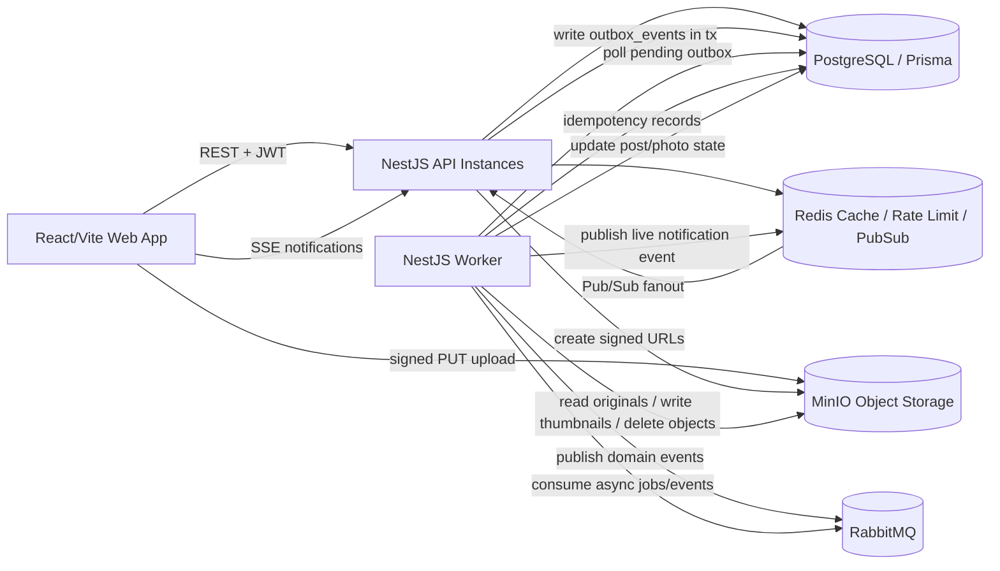

# Architecture notes: Decogramy

## Goals

- Build a small Instagram-like app focused only on photos.
- Include the basic product flow: register/login, public profiles, photo grid, upload, feed, likes, follow/unfollow and notifications.
- Keep PostgreSQL as the source of truth.
- Move non-critical work to a worker process: thumbnails, cleanup and notification fan-out.
- Run everything locally with Docker Compose using PostgreSQL, Redis, RabbitMQ and MinIO.
- Use MinIO in the demo as the local equivalent of object storage such as Cloudflare R2/S3.

## Out of scope

- No private accounts or private posts.
- No video, livestreaming, stories, direct messages, or recommendations.
- No MongoDB.
- No PostgreSQL replicas, database redundancy, or high-availability setup.
- No Cloudflare Workers.
- No email verification for registration.

## Technology stack and repository layout

Repository layout:

```text
apps/
  api/       NestJS HTTP API + SSE endpoints
  worker/    NestJS worker process for outbox publishing and async consumers
  web/       React/Vite frontend
packages/
  shared/    Optional shared DTOs/types/constants
```

Core components:

- Frontend: React + Vite.
- Backend: NestJS, with API and worker as separate processes in one codebase/repository.
- Database: PostgreSQL via Prisma, source of truth for users, posts, likes, comments, follows, notifications, sessions, and outbox state.
- Cache/coordination: Redis for non-critical cache, rate limiting, and Redis Pub/Sub for SSE fanout across API instances.
- Queue/events: RabbitMQ for asynchronous work and internal domain events.
- Object storage: MinIO locally. It conceptually represents Cloudflare R2 for the presentation.
- Image processing: Sharp in the worker for thumbnail generation.

## Architecture diagram



## Service responsibilities

### Web app

- Registration and login forms.
- Public profile pages and profile photo grid.
- Home feed with cursor pagination.
- Photo upload flow using API-created post and direct signed URL upload.
- Like, comment, follow/unfollow interactions.
- SSE connection for lightweight live notifications.

### API process

- Exposes REST endpoints and SSE endpoints.
- Validates requests using `ValidationPipe`, `class-validator`, and `class-transformer`.
- Provides Swagger/OpenAPI documentation if it is enabled for the demo.
- Handles authentication with JWT access tokens. The original design included refresh token rotation, but the reduced MVP can run with a single JWT.
- Performs transactional writes to PostgreSQL.
- Creates notification rows in the main transaction for relevant user actions.
- Writes `outbox_events` in the same PostgreSQL transaction as domain changes.
- Creates signed upload URLs for MinIO/R2 after validating declared MIME type and size.
- Verifies the uploaded object exists during finalize before publishing the post.
- Applies Redis-backed rate limits where configured.

### Worker process

- Polls pending `outbox_events` and publishes them to RabbitMQ.
- Consumes RabbitMQ domain events and jobs.
- Generates thumbnails using Sharp.
- Validates actual uploaded object metadata before processing.
- Performs asynchronous MinIO cleanup for deleted/expired posts.
- Publishes lightweight live notification messages to Redis Pub/Sub after consuming relevant domain events.
- Uses `processed_events` for idempotent handlers.
- Updates outbox publishing status and records failures.

### PostgreSQL

- Source of truth for all core application state.
- Stores users, posts, photos, follows, likes, comments, notifications, refresh sessions, outbox events, and processed event records.

### Redis

- Non-critical hot cache, especially for hot like counts; if unavailable, the API bypasses cache and reads PostgreSQL.
- Rate limiting for auth, upload URL creation, comments, and likes.
- Redis Pub/Sub bridge for live SSE notification fanout across API instances.
- If Redis is unavailable, SSE live delivery is lost and MVP rate limiting fails open as an explicit availability tradeoff.

### RabbitMQ

- Internal asynchronous domain event transport.
- At-least-once delivery.
- Supports delayed/backoff retries and dead-letter queues.

### MinIO / R2

- Stores original uploaded images and generated thumbnails.
- Local MVP uses MinIO.
- Local MVP object URLs are public/readable for originals and thumbnails.
- In the presentation, MinIO represents the R2/object-storage role and public object URLs represent the CDN-served media path.

## Data model outline

Main tables and fields:

- users: `id`, `email`, `username`, `password_hash`, `display_name`, `bio`, `created_at`, `updated_at`.
  - `email` unique.
  - `username` unique and immutable.
- refresh_sessions: `id`, `user_id`, `token_hash`, `user_agent`, `ip_address`, `expires_at`, `revoked_at`, `created_at`, `rotated_at`.
- posts: `id`, `user_id`, `caption`, `status`, `likes_count`, `comments_count`, `created_at`, `updated_at`, `deleted_at`.
  - `status`: `upload_pending | published | deleted | upload_expired`.
- photos: `id`, `post_id`, `original_key`, `thumbnail_key`, `mime_type`, `size_bytes`, `thumbnail_status`, `created_at`, `updated_at`.
  - `thumbnail_status`: `pending | processing | ready | failed`.
- follows: `follower_id`, `following_id`, `created_at`.
  - Unique pair.
  - Constraint/application check prevents self-follow.
- likes: `user_id`, `post_id`, `created_at`.
  - Unique pair.
  - `posts.likes_count` updated transactionally.
- comments: `id`, `post_id`, `author_id`, `body`, `created_at`, `updated_at`, `deleted_at`.
  - Flat comments only.
  - Author can edit/delete own comments.
  - Post owner can delete comments on own post but cannot edit them.
- notifications: `id`, `user_id`, `actor_id`, `type`, `entity_type`, `entity_id`, `payload`, `read_at`, `created_at`.
- outbox_events: `id`, `event_type`, `aggregate_type`, `aggregate_id`, `payload`, `status`, `attempts`, `next_attempt_at`, `locked_at`, `locked_by`, `last_error`, `created_at`, `published_at`.
  - `status`: `pending | processing | published | failed`.
  - `failed` is for exhausted/non-retryable rows; RabbitMQ downtime leaves rows retryable with `next_attempt_at`.
- processed_events: `event_id`, `handler_name`, `processed_at`.
  - Unique pair for idempotent consumers.

## Key flows

### Registration and login

1. User registers with email, username and password.
2. API validates unique email and username.
3. Password is hashed with Argon2id.
4. API creates user and initial refresh session in PostgreSQL.
5. API returns JWT access token and sets refresh token in an `httpOnly` cookie.
6. Access token is kept in frontend memory.

Refresh flow:

1. Browser sends refresh token cookie.
2. API verifies hashed refresh token session in PostgreSQL.
3. API rotates refresh token on every refresh by revoking/replacing the session token hash.
4. API returns a new access token and sets a new refresh cookie.

### Upload and publish photo

1. Frontend asks the API to create an upload with declared MIME type, extension and size.
2. API allows only `image/jpeg`, `image/png`, and `image/webp`, maximum 10 MB based on declared metadata. Signed PUT size/content hints are not fully trusted.
3. API creates a post with `posts.status = upload_pending` and a photo with `thumbnail_status = pending`.
4. API controls object keys:
   - Original: `posts/{postId}/original.{ext}`
   - Thumbnail: `posts/{postId}/thumbnail.webp`
5. API returns a signed upload URL for the original object.
6. Frontend uploads directly to MinIO/R2.
7. Frontend calls finalize.
8. API verifies the expected object exists in MinIO/R2 before publishing.
9. API marks the post `published` after that existence check, so it can appear in feeds even if the thumbnail is still pending.
10. API writes outbox events such as `post.created` and `image.thumbnail.requested`.
11. Worker validates actual object metadata and image readability before processing. If MIME/size/content metadata is invalid or mismatched, it can mark thumbnail generation failed and delete/cleanup the invalid upload asynchronously.
12. Worker generates a 400x400 center-cropped WebP thumbnail with Sharp.
13. Worker updates `photos.thumbnail_status` to `ready` or `failed`.

Pending uploads expire after about 30 minutes. A scheduled worker/scanner marks old `upload_pending` rows as `upload_expired`, and object cleanup is performed asynchronously.

### Delete post

1. Owner requests deletion.
2. API soft-deletes immediately by setting `posts.status = deleted` and `deleted_at`.
3. Deleted posts are hidden from feeds, profiles, likes, and comments views.
4. Existing likes/comments remain in PostgreSQL but are hidden through the deleted post status.
5. API writes `post.deleted` to the outbox.
6. Worker asynchronously deletes original and thumbnail objects from MinIO/R2.

### Feed and pagination

- Feed is read directly from PostgreSQL.
- Home feed includes posts from followed users plus the current user's own posts, filtered by `posts.status = published AND deleted_at IS NULL`.
- Profile grid lists a user's published posts with the same visibility filter.
- Cursor pagination uses `created_at` plus `id`/`post_id` as a stable tie-breaker.
- Feed displays original images.
- Profile grid displays thumbnails when ready and can fall back to original or placeholder while thumbnail is pending/failed.

### Likes

1. API inserts/deletes a row in `likes` with a uniqueness constraint on `(user_id, post_id)`.
2. API transactionally increments/decrements `posts.likes_count`.
3. Redis may cache hot like counts, but PostgreSQL remains authoritative.
4. API creates a `post.liked` notification row unless the actor owns the post.
5. API writes `post.liked` or `post.unliked` to the outbox.

### Comments

- Comments are flat and cursor paginated.
- Author can edit/delete own comments.
- Post owner can delete comments on their post but cannot edit them.
- Creating a comment creates a `comment.created` notification unless the actor owns the post.
- Comment creation/deletion transactionally increments/decrements `posts.comments_count`.
- Comment creation writes `comment.created` to the outbox.

### Follow/unfollow

- API prevents self-follow.
- Follow creates a unique `(follower_id, following_id)` relationship.
- Follow creates a `user.followed` notification.
- Follow/unfollow writes `user.followed` or `user.unfollowed` to the outbox.

### Notifications and SSE

1. API creates stored notification rows in PostgreSQL inside the main transaction for:
   - `post.liked`, unless actor owns post.
   - `comment.created`, unless actor owns post.
   - `user.followed`.
2. API writes the corresponding domain event to the outbox in the same transaction.
3. The worker publishes the outbox event to RabbitMQ, consumes the relevant event, and publishes a lightweight live notification event to Redis Pub/Sub.
4. All API instances subscribe to Redis Pub/Sub and forward matching events to connected users through SSE.
5. Redis/SSE payloads include the durable `notification_id`.
6. SSE is best-effort only. The core app does not depend on SSE being available, and Redis Pub/Sub message loss is acceptable because PostgreSQL notifications are authoritative.
7. Clients recover after reconnect by fetching stored notifications with cursor pagination or a `since` notification id.

## Events, retry and idempotency

### Outbox pattern

- API writes `outbox_events` in the same PostgreSQL transaction as the business state change.
- Worker polls due pending rows using `next_attempt_at`, locks them with `processing`/`locked_at`/`locked_by`, and skips rows locked by another worker until the lock expires.
- Worker publishes each event to RabbitMQ and waits for publisher confirms.
- Worker marks rows as `published` only after RabbitMQ confirms the publish.
- On publish failure or RabbitMQ downtime, worker increments `attempts`, records `last_error`, resets rows to retryable `pending`, and schedules `next_attempt_at`; rows are not terminal `failed` solely because RabbitMQ is down.

Domain events:

- `image.thumbnail.requested`
- `image.thumbnail.completed`
- `image.thumbnail.failed`
- `post.created`
- `post.deleted`
- `post.liked`
- `post.unliked`
- `comment.created`
- `user.followed`
- `user.unfollowed`

Minimal event payload contract:

- `event_id`, `type`, `aggregate_type`, `aggregate_id`, `occurred_at`, and `payload`.
- `actor_id` when a user initiated the event.
- `target_user_id` when the event is directed at one user, such as notifications.
- `notification_id` when a durable notification row was created.
- `image.thumbnail.completed` and `image.thumbnail.failed` are emitted for observability and downstream state-transition/audit consumers.

### RabbitMQ delivery

- RabbitMQ is at-least-once.
- Consumers must be idempotent.
- Retry schedule: 10 seconds, 30 seconds, 2 minutes, then dead-letter queue.
- Delayed/backoff retries can be implemented with delayed exchanges or TTL retry queues.
- Dead-letter queues are used for events that repeatedly fail and require inspection.

### Idempotency

- Each handler records `(event_id, handler_name, processed_at)` in `processed_events` only after successful handling, ideally in the same PostgreSQL transaction as any database effects.
- Before handling, a consumer checks for an existing processed record and avoids duplicate database effects.
- Duplicate deliveries are acknowledged without re-running side effects.
- External/object-storage operations cannot share the database transaction, so they must be idempotent and tolerate duplicates, for example overwriting the same thumbnail key or deleting already-missing objects.

## Failure behavior

- PostgreSQL down: core API actions fail because PostgreSQL is the source of truth.
- Redis down: cache is bypassed, SSE live delivery is lost, and MVP rate limiting fails open. Core PostgreSQL-backed actions continue where safe.
- RabbitMQ down: API actions still commit to PostgreSQL and outbox rows remain pending. Events publish later when RabbitMQ returns.
- Worker down: API actions still work. Thumbnails, cleanup, and other async side effects are delayed.
- MinIO/R2 down during signed URL creation: upload creation/finalization fails until object storage is available.
- MinIO/R2 down during thumbnail or cleanup: worker retries and eventually sends event to DLQ if failures persist.
- SSE disconnected: user misses only live delivery. Stored notifications remain queryable.
- Thumbnail generation failed: post remains published; profile grid can show placeholder/original fallback and mark thumbnail as failed.

## Local Docker Compose components

Minimum local services:

- `postgres`: application database.
- `redis`: cache, rate limiter storage, and Pub/Sub.
- `rabbitmq`: event broker with management UI enabled for development.
- `minio`: local S3-compatible object storage.
- `api`: NestJS API process.
- `worker`: NestJS worker process.
- `web`: React/Vite frontend dev server.

Useful local ports may include:

- API: `3000`
- Web: `5173`
- PostgreSQL: `5432`
- Redis: `6379`
- RabbitMQ: `5672`, management UI `15672`
- MinIO API: `9000`, console `9001`

## Cloudflare mapping for the presentation

- There is no production environment for this project. The Docker Compose setup is the version used in the presentation.
- MinIO represents the object-storage role that Cloudflare R2 or S3 would have in a deployed version.
- Public MinIO object URLs stand in for CDN-served media URLs.
- Cloudflare Workers are not implemented.
- PostgreSQL redundancy and replicas were left out to keep the demo focused.

## Initial implementation milestones

1. Monorepo foundation
   - Create `apps/api`, `apps/worker`, `apps/web`, and optional `packages/shared`.
   - Add Docker Compose for PostgreSQL, Redis, RabbitMQ, and MinIO.
2. Auth and users
   - Implement registration, login, refresh rotation, logout, Argon2id hashing, and public profiles.
3. Database schema
   - Add Prisma models for users, sessions, posts, photos, follows, likes, comments, notifications, outbox, and processed events.
4. Upload pipeline
   - Implement create-upload, signed URL generation, finalize, post status transitions, and pending upload cleanup.
5. Worker and outbox
   - Implement outbox publisher, RabbitMQ consumers, retries, DLQ, and processed-event idempotency.
6. Thumbnail processing
   - Implement Sharp thumbnail generation and photo state updates.
7. Social features
   - Implement follow/unfollow, home feed, profile grid, likes, and flat comments.
8. Notifications
   - Implement stored notifications, Redis Pub/Sub fanout, and SSE delivery.
9. Validation and documentation
   - Add rate limits, DTO validation, Swagger/OpenAPI, and basic integration tests for key flows.

## Reduced scope for a 2-person, 2-day build

The full milestone list above does not fit a 2-day build. This reduced scope keeps
the parts that matter most for the distributed-systems demo: outbox, async worker,
idempotency and SSE fan-out. Less important product features are left out.

Explicitly cut for the 2-day version: refresh token rotation (single JWT, no
rotation), general rate limiting, Swagger/OpenAPI, integration tests, DLQ
inspection tooling. Comments are optional, only if time remains.

### Day 1 — Foundation and the distributed spine

Person A — infra/backend:
- Minimal monorepo: `apps/api`, `apps/worker` (`apps/web` can run outside
  the compose via `vite dev` during development).
- Docker Compose: postgres, redis, rabbitmq, minio, api, worker.
- Prisma models: `users`, `posts`, `photos`, `follows`, `likes`,
  `notifications`, `outbox_events`, `processed_events` (no
  `refresh_sessions` — a single JWT without rotation).
- Auth: register/login, Argon2id hashing, single JWT.

Person B — upload pipeline and worker:
- Create-upload endpoint → signed MinIO URL → finalize with outbox writes
  (`post.created`, `image.thumbnail.requested`).
- Worker: outbox publisher → RabbitMQ → thumbnail consumer → Sharp →
  updates `photos.thumbnail_status`.
- `processed_events` idempotency for that consumer.

End-of-day goal: register, log in, upload a photo, watch it become a
thumbnail, see it in the feed. That path already covers outbox + async
worker + idempotency.

### Day 2 — Close the distributed loop and build the UI

Person A:
- Likes: outbox event (`post.liked`) + stored notification.
- Follow/unfollow (simple CRUD).
- Feed with cursor pagination.

Person B:
- SSE + Redis Pub/Sub for at least the `post.liked` event → live
  notification delivery.
- Screens: feed, profile/grid, upload, notifications.
- Prepare a failure demo: stop the worker or RabbitMQ during the presentation
  and show that likes/uploads are still accepted. When the service returns,
  the pending work is processed.

Last hour: rehearse the presentation with at least one failure scenario
(Redis or RabbitMQ going down). Prefer that over adding another small feature at the end.
