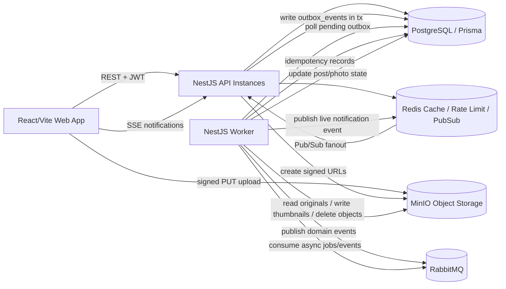

# Notas de arquitetura: Decogramy

## Objetivos

- Construir um app pequeno no estilo Instagram, focado apenas em fotos.
- Incluir o fluxo básico do produto: cadastro/login, perfis públicos, grid de fotos, upload, feed, likes, follow/unfollow e notificações.
- Manter o PostgreSQL como fonte de verdade.
- Mover trabalho não crítico para um processo worker: thumbnails, limpeza e fan-out de notificações.
- Rodar tudo localmente com Docker Compose usando PostgreSQL, Redis, RabbitMQ e MinIO.
- Usar o MinIO como equivalente local de object storage, como Cloudflare R2/S3.

## Fora do escopo

- Sem contas privadas ou posts privados.
- Sem vídeo, livestreaming, stories, mensagens diretas ou recomendações.
- Sem MongoDB.
- Sem réplicas PostgreSQL, redundância de banco ou configuração de alta disponibilidade.
- Sem Cloudflare Workers.
- Sem verificação de e-mail no cadastro.

## Stack de tecnologia e estrutura do repositório

Estrutura do repositório:

```text
apps/
  api/       NestJS HTTP API + SSE endpoints
  worker/    NestJS worker process for outbox publishing and async consumers
  web/       React/Vite frontend
packages/
  shared/    DTOs/tipos/constantes compartilhados opcionais
```

Componentes principais:

- Frontend: React + Vite.
- Backend: NestJS, com API e worker como processos separados no mesmo código/repositório.
- Banco de dados: PostgreSQL via Prisma, fonte de verdade para usuários, posts, likes, comentários, follows, notificações, sessões e estado da outbox.
- Cache/coordenação: Redis para cache não crítico, rate limiting e Redis Pub/Sub para fanout de SSE entre instâncias da API.
- Filas/eventos: RabbitMQ para trabalho assíncrono e eventos internos de domínio.
- Object storage: MinIO localmente, representando o papel de um serviço como Cloudflare R2/S3.
- Processamento de imagem: Sharp no worker para geração de thumbnails.

## Diagrama de arquitetura



## Responsabilidades dos serviços

### Aplicação web

- Formulários de cadastro e login.
- Páginas públicas de perfil e grid de fotos do perfil.
- Home feed com paginação por cursor.
- Fluxo de upload de foto usando post criado pela API e upload direto por URL assinada.
- Interações de like, comentário e follow/unfollow.
- Conexão SSE para notificações leves em tempo real.

### Processo API

- Expõe endpoints REST e endpoints SSE.
- Valida requisições com `ValidationPipe`, `class-validator` e `class-transformer`.
- Fornece documentação Swagger/OpenAPI se estiver habilitada no ambiente local.
- Faz autenticação com tokens JWT de acesso. O desenho original previa rotação de refresh token, mas o MVP reduzido pode rodar com um único JWT.
- Executa escritas transacionais no PostgreSQL.
- Cria linhas de notificação na transação principal para ações relevantes do usuário.
- Grava `outbox_events` na mesma transação PostgreSQL das mudanças de domínio.
- Cria URLs assinadas de upload para MinIO/R2 depois de validar MIME type e tamanho declarados.
- Verifica se o objeto enviado existe durante o finalize antes de publicar o post.
- Aplica rate limits baseados em Redis onde configurado.

### Processo worker

- Consulta `outbox_events` pendentes e publica no RabbitMQ.
- Consome eventos de domínio e jobs do RabbitMQ.
- Gera thumbnails usando Sharp.
- Valida metadados reais do objeto enviado antes de processar.
- Faz limpeza assíncrona no MinIO para posts apagados/expirados.
- Publica mensagens leves de notificação ao vivo no Redis Pub/Sub depois de consumir eventos de domínio relevantes.
- Usa `processed_events` para handlers idempotentes.
- Atualiza o status de publicação da outbox e registra falhas.

### PostgreSQL

- Fonte de verdade para todo o estado central da aplicação.
- Armazena usuários, posts, fotos, follows, likes, comentários, notificações, sessões de refresh, eventos de outbox e registros de eventos processados.

### Redis

- Cache quente não crítico, principalmente para contagens de likes; se estiver indisponível, a API ignora o cache e lê do PostgreSQL.
- Rate limiting para auth, criação de URL de upload, comentários e likes.
- Ponte Redis Pub/Sub para fanout de notificações SSE ao vivo entre instâncias da API.
- Se o Redis cair, a entrega ao vivo via SSE é perdida e o rate limiting do MVP falha em modo aberto, como troca explícita por disponibilidade.

### RabbitMQ

- Transporte interno assíncrono de eventos de domínio.
- Entrega at-least-once.
- Suporta retries com atraso/backoff e dead-letter queues.

### MinIO / R2

- Armazena imagens originais enviadas e thumbnails geradas.
- O MVP local usa MinIO.
- As URLs locais de objetos são públicas/legíveis para originais e thumbnails.
- O MinIO representa o papel de R2/object-storage, e URLs públicas de objetos representam o caminho de mídia que poderia ser servido por CDN.

## Visão geral do modelo de dados

Principais tabelas e campos:

- users: `id`, `email`, `username`, `password_hash`, `display_name`, `bio`, `created_at`, `updated_at`.
  - `email` único.
  - `username` único e imutável.
- refresh_sessions: `id`, `user_id`, `token_hash`, `user_agent`, `ip_address`, `expires_at`, `revoked_at`, `created_at`, `rotated_at`.
- posts: `id`, `user_id`, `caption`, `status`, `likes_count`, `comments_count`, `created_at`, `updated_at`, `deleted_at`.
  - `status`: `upload_pending | published | deleted | upload_expired`.
- photos: `id`, `post_id`, `original_key`, `thumbnail_key`, `mime_type`, `size_bytes`, `thumbnail_status`, `created_at`, `updated_at`.
  - `thumbnail_status`: `pending | processing | ready | failed`.
- follows: `follower_id`, `following_id`, `created_at`.
  - Par único.
  - Constraint/verificação na aplicação impede seguir a si mesmo.
- likes: `user_id`, `post_id`, `created_at`.
  - Par único.
  - `posts.likes_count` atualizado transacionalmente.
- comments: `id`, `post_id`, `author_id`, `body`, `created_at`, `updated_at`, `deleted_at`.
  - Apenas comentários planos.
  - Autor pode editar/apagar os próprios comentários.
  - Dono do post pode apagar comentários no próprio post, mas não pode editá-los.
- notifications: `id`, `user_id`, `actor_id`, `type`, `entity_type`, `entity_id`, `payload`, `read_at`, `created_at`.
- outbox_events: `id`, `event_type`, `aggregate_type`, `aggregate_id`, `payload`, `status`, `attempts`, `next_attempt_at`, `locked_at`, `locked_by`, `last_error`, `created_at`, `published_at`.
  - `status`: `pending | processing | published | failed`.
  - `failed` vale para linhas esgotadas/não retryable; queda do RabbitMQ mantém linhas retryable com `next_attempt_at`.
- processed_events: `event_id`, `handler_name`, `processed_at`.
  - Par único para consumidores idempotentes.

## Fluxos principais

### Cadastro e login

1. Usuário se cadastra com e-mail, username e senha.
2. API valida e-mail e username únicos.
3. Senha é hasheada com Argon2id.
4. API cria usuário e sessão inicial de refresh no PostgreSQL.
5. API retorna JWT access token e define refresh token em um cookie `httpOnly`.
6. Access token fica em memória no frontend.

Fluxo de refresh:

1. Navegador envia o cookie de refresh token.
2. API verifica no PostgreSQL a sessão do refresh token hasheado.
3. API rotaciona o refresh token a cada refresh revogando/substituindo o hash do token da sessão.
4. API retorna um novo access token e define um novo cookie de refresh.

### Upload e publicação de foto

1. Frontend pede à API a criação de um upload com MIME type, extensão e tamanho declarados.
2. API aceita apenas `image/jpeg`, `image/png` e `image/webp`, máximo de 10 MB com base nos metadados declarados. Dicas de tamanho/conteúdo do PUT assinado não são totalmente confiáveis.
3. API cria um post com `posts.status = upload_pending` e uma foto com `thumbnail_status = pending`.
4. API controla as chaves dos objetos:
   - Original: `posts/{postId}/original.{ext}`
   - Thumbnail: `posts/{postId}/thumbnail.webp`
5. API retorna uma URL assinada para upload do objeto original.
6. Frontend envia o arquivo direto para MinIO/R2.
7. Frontend chama finalize.
8. API verifica se o objeto esperado existe no MinIO/R2 antes de publicar.
9. API marca o post como `published` depois dessa verificação de existência, então ele pode aparecer nos feeds mesmo com thumbnail ainda pendente.
10. API grava eventos de outbox como `post.created` e `image.thumbnail.requested`.
11. Worker valida metadados reais do objeto e se a imagem pode ser lida antes de processar. Se MIME/tamanho/conteúdo for inválido ou não bater, ele pode marcar a geração de thumbnail como falha e limpar o upload inválido de forma assíncrona.
12. Worker gera uma thumbnail WebP 400x400 com crop central usando Sharp.
13. Worker atualiza `photos.thumbnail_status` para `ready` ou `failed`.

Uploads pendentes expiram após cerca de 30 minutos. Um worker/scanner agendado marca linhas antigas `upload_pending` como `upload_expired`, e a limpeza de objetos é feita de forma assíncrona.

### Apagar post

1. Dono solicita a remoção.
2. API faz soft delete imediatamente definindo `posts.status = deleted` e `deleted_at`.
3. Posts apagados ficam ocultos em feeds, perfis, likes e telas de comentários.
4. Likes/comentários existentes continuam no PostgreSQL, mas ficam ocultos pelo status de post apagado.
5. API grava `post.deleted` na outbox.
6. Worker apaga de forma assíncrona os objetos original e thumbnail do MinIO/R2.

### Feed e paginação

- Feed é lido diretamente do PostgreSQL.
- Home feed inclui posts de usuários seguidos mais os posts do próprio usuário atual, filtrados por `posts.status = published AND deleted_at IS NULL`.
- Grid de perfil lista posts publicados de um usuário com o mesmo filtro de visibilidade.
- Paginação por cursor usa `created_at` mais `id`/`post_id` como critério estável de desempate.
- Feed exibe imagens originais.
- Grid de perfil exibe thumbnails quando prontas e pode voltar para original ou placeholder enquanto a thumbnail está pendente/falhou.

### Likes

1. API insere/remove uma linha em `likes` com constraint de unicidade em `(user_id, post_id)`.
2. API incrementa/decrementa `posts.likes_count` transacionalmente.
3. Redis pode cachear contagens quentes de likes, mas PostgreSQL continua sendo a fonte autoritativa.
4. API cria uma linha de notificação `post.liked`, exceto quando o ator é dono do post.
5. API grava `post.liked` ou `post.unliked` na outbox.

### Comentários

- Comentários são planos e paginados por cursor.
- Autor pode editar/apagar os próprios comentários.
- Dono do post pode apagar comentários no próprio post, mas não pode editá-los.
- Criar comentário gera uma notificação `comment.created`, exceto quando o ator é dono do post.
- Criação/remoção de comentário incrementa/decrementa `posts.comments_count` transacionalmente.
- Criação de comentário grava `comment.created` na outbox.

### Follow/unfollow

- API impede seguir a si mesmo.
- Follow cria uma relação única `(follower_id, following_id)`.
- Follow cria uma notificação `user.followed`.
- Follow/unfollow grava `user.followed` ou `user.unfollowed` na outbox.

### Notificações e SSE

1. API cria linhas de notificação armazenadas no PostgreSQL dentro da transação principal para:
   - `post.liked`, exceto quando o ator é dono do post.
   - `comment.created`, exceto quando o ator é dono do post.
   - `user.followed`.
2. API grava o evento de domínio correspondente na outbox, na mesma transação.
3. Worker publica o evento da outbox no RabbitMQ, consome o evento relevante e publica uma notificação leve no Redis Pub/Sub.
4. Todas as instâncias da API assinam o Redis Pub/Sub e encaminham eventos correspondentes para usuários conectados via SSE.
5. Payloads Redis/SSE incluem o `notification_id` durável.
6. SSE é apenas best-effort. O app principal não depende de SSE disponível, e perda de mensagem no Redis Pub/Sub é aceitável porque as notificações no PostgreSQL são autoritativas.
7. Clientes se recuperam após reconectar buscando notificações armazenadas com paginação por cursor ou um id de notificação `since`.

## Eventos, retry e idempotência

### Padrão outbox

- API grava `outbox_events` na mesma transação PostgreSQL da mudança de estado de negócio.
- Worker busca linhas pendentes vencidas usando `next_attempt_at`, trava com `processing`/`locked_at`/`locked_by` e pula linhas travadas por outro worker até o lock expirar.
- Worker publica cada evento no RabbitMQ e espera publisher confirms.
- Worker marca linhas como `published` somente depois da confirmação do RabbitMQ.
- Em falha de publish ou queda do RabbitMQ, o worker incrementa `attempts`, registra `last_error`, retorna as linhas para `pending` retryable e agenda `next_attempt_at`; linhas não viram `failed` terminal só porque o RabbitMQ caiu.

Eventos de domínio:

- `image.thumbnail.requested`
- `image.thumbnail.completed`
- `image.thumbnail.failed`
- `post.created`
- `post.deleted`
- `post.liked`
- `post.unliked`
- `comment.created`
- `user.followed`
- `user.unfollowed`

Contrato mínimo do payload de evento:

- `event_id`, `type`, `aggregate_type`, `aggregate_id`, `occurred_at` e `payload`.
- `actor_id` quando um usuário iniciou o evento.
- `target_user_id` quando o evento é direcionado a um usuário, como em notificações.
- `notification_id` quando uma linha de notificação durável foi criada.
- `image.thumbnail.completed` e `image.thumbnail.failed` são emitidos para observabilidade e para consumidores downstream de transição de estado/auditoria.

### Entrega pelo RabbitMQ

- RabbitMQ é at-least-once.
- Consumidores precisam ser idempotentes.
- Agenda de retry: 10 segundos, 30 segundos, 2 minutos e depois dead-letter queue.
- Retries com atraso/backoff podem ser implementados com delayed exchanges ou filas de retry com TTL.
- Dead-letter queues são usadas para eventos que falham repetidamente e precisam de inspeção.

### Idempotência

- Cada handler registra `(event_id, handler_name, processed_at)` em `processed_events` apenas depois de processar com sucesso, idealmente na mesma transação PostgreSQL dos efeitos no banco.
- Antes de processar, um consumidor verifica se já existe registro processado e evita efeitos duplicados no banco.
- Entregas duplicadas são acknowledged sem rodar os efeitos colaterais de novo.
- Operações externas/object-storage não compartilham a transação do banco, então precisam ser idempotentes e tolerar duplicatas, por exemplo sobrescrevendo a mesma chave de thumbnail ou apagando objetos que já não existem.

## Comportamento em falhas

- PostgreSQL fora: ações centrais da API falham porque PostgreSQL é a fonte de verdade.
- Redis fora: cache é ignorado, entrega ao vivo por SSE é perdida e o rate limiting do MVP falha em modo aberto. Ações centrais baseadas em PostgreSQL continuam quando for seguro.
- RabbitMQ fora: ações da API ainda são commitadas no PostgreSQL e linhas da outbox ficam pendentes. Os eventos são publicados depois que o RabbitMQ volta.
- Worker fora: ações da API continuam funcionando. Thumbnails, limpeza e outros efeitos assíncronos atrasam.
- MinIO/R2 fora durante criação de URL assinada: criação/finalização de upload falha até o object storage voltar.
- MinIO/R2 fora durante thumbnail ou limpeza: worker tenta novamente e, se as falhas persistirem, envia o evento para DLQ.
- SSE desconectado: usuário perde apenas a entrega ao vivo. Notificações armazenadas continuam consultáveis.
- Geração de thumbnail falhou: post continua publicado; grid de perfil pode mostrar placeholder/original como fallback e marcar a thumbnail como falha.

## Componentes locais no Docker Compose

Serviços mínimos locais:

- `postgres`: banco de dados da aplicação.
- `redis`: cache, armazenamento do rate limiter e Pub/Sub.
- `rabbitmq`: broker de eventos com management UI habilitada para desenvolvimento.
- `minio`: object storage local compatível com S3.
- `api`: processo NestJS da API.
- `worker`: processo NestJS do worker.
- `web`: servidor de desenvolvimento do frontend React/Vite.

Portas locais úteis podem incluir:

- API: `3000`
- Web: `5173`
- PostgreSQL: `5432`
- Redis: `6379`
- RabbitMQ: `5672`, management UI `15672`
- MinIO API: `9000`, console `9001`

## Equivalência com serviços de nuvem

- O ambiente principal do projeto é o Docker Compose local.
- MinIO representa o papel de object storage que Cloudflare R2 ou S3 teria em uma versão implantada.
- URLs públicas de objetos no MinIO fazem o papel de URLs de mídia que poderiam ser servidas por CDN.
- Cloudflare Workers não foram implementados.
- Redundância e réplicas do PostgreSQL ficaram fora para manter o escopo do trabalho controlado.

## Marcos iniciais de implementação

1. Base do monorepo
   - Criar `apps/api`, `apps/worker`, `apps/web` e `packages/shared` opcional.
   - Adicionar Docker Compose para PostgreSQL, Redis, RabbitMQ e MinIO.
2. Auth e usuários
   - Implementar cadastro, login, rotação de refresh, logout, hash Argon2id e perfis públicos.
3. Schema do banco
   - Adicionar models Prisma para usuários, sessões, posts, fotos, follows, likes, comentários, notificações, outbox e eventos processados.
4. Pipeline de upload
   - Implementar create-upload, geração de URL assinada, finalize, transições de status do post e limpeza de upload pendente.
5. Worker e outbox
   - Implementar publicador da outbox, consumidores RabbitMQ, retries, DLQ e idempotência por processed-event.
6. Processamento de thumbnail
   - Implementar geração de thumbnail com Sharp e atualização do estado da foto.
7. Funcionalidades sociais
   - Implementar follow/unfollow, home feed, grid de perfil, likes e comentários planos.
8. Notificações
   - Implementar notificações armazenadas, fanout com Redis Pub/Sub e entrega via SSE.
9. Validação e documentação
   - Adicionar rate limits, validação de DTOs, Swagger/OpenAPI e testes básicos de integração para fluxos principais.
